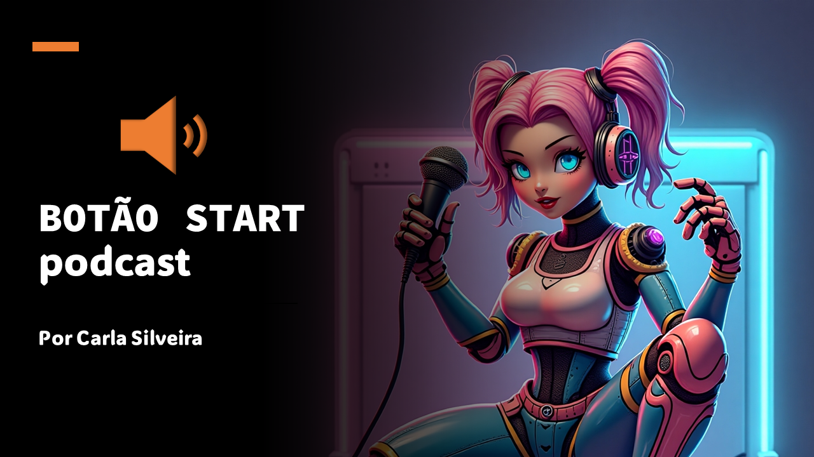

# Projeto Podcast Gerado por Inteligência Artificial

> ℹ️ **NOTE:** Este é um repositório criado durante o curso "Criando um Podcast com IAs Generativas", promovido pela [DIO](https://dio.me).

Projeto com o objetivo de gerar um podcast utilizando ferramentas de IA através de prompts mais trabalhados.

Utilizar uma esteira de prompts para gerar cada etapa do processo criativo.                                                                                                   
         

                                                                                                                                                                                     
> Ouça o [podcast](https://github.com/rosacarla/prompts-for-podcast-generate-by-ia/blob/main/output/podcast001.mp3)

---  

## 💻 Tecnologias utilizadas

- [ChatGPT](https://chat.openai.com/) 
- [Leonardo.Ai](https://app.leonardo.ai/)
- [ElevenLabs](https://beta.elevenlabs.io/)
- [Capcut](https://www.capcut.com/pt-br/)  

---  

## ✨ Como foi feito?

- Roteiro gerado via ChatGPT
- Audio gerado pela ElevenLabs
- Leonardo.Ai para gerar capas
- CapCut para tratar aúdio e adicionar sons de fundo  

---  

## 📚 Materiais  
   
- [Notion Template](https://helpful-jump-17b.notion.site/PAS-Podcast-AI-Studio-210489e15d7a4a73b743bb159e45d06f?pvs=4)
- [Editor de aúdio](https://www.capcut.com/editor?from_page=landing_page&__action_from=picture_V%C3%ADdeos%20profissionais%20em%20minutos,%20n%C3%A3o%20em%20horas.)
- Prompt para gerar imagens de capas (opção 1): "a podcaster young girl long curly hair smiling with microphone, side by side night city, camera settings f/ 8, 1/ 100s, ISO 100, complex lighting, backlighting, dynamic cinematic lighting, global illumination, ultra-high resolution,realistic filter of real colors, photo processing in 16K, cinematic, photorealistic, hyperrealistic ,hyper realistic, cinematic light, ultra realistic photography, ultra detailed --ar 1:1 --v 5.2"     
- Prompt para gerar imagens de capas (opção 2):   

  

---  

## 🛠️ Instruções de execução

Utilize os prompts fornecidos dentro do link do `Notion` na parte de `Materiais` para criar um podcast de maneira automatizada, para isso siga o passo a passo abaixo.

- 🤖 1. Use os prompts de roteiro no `ChatGPT`
- 🤖 2. Use os prompts de roteiro gerados pelo chatgpt no  `ElevenLabs`
- 🤖 3. Use os prompts de artes no `Leonardo.Ai`   

---  

## 👨‍💻 Expert

[Carla Silveira](https://github.com/rosacarla)
